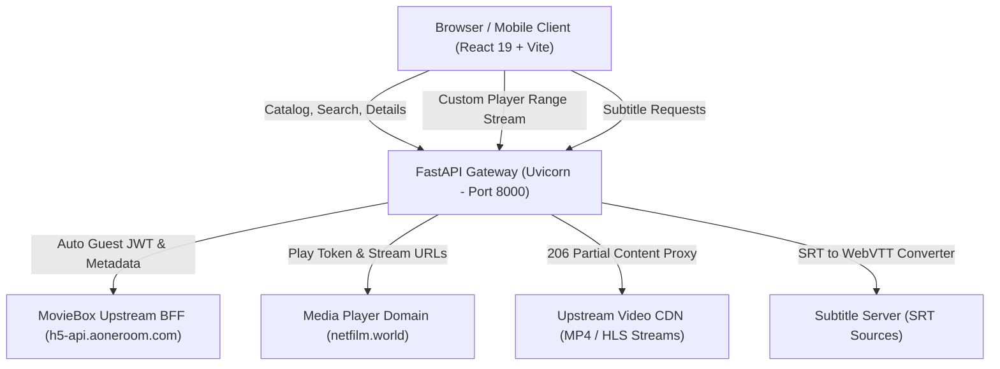

<p align="center">
  
</p>

<h1 align="center">🎬 MovieBox — Full-Stack Streaming Platform</h1>

<p align="center">
  A full-stack, high-performance video streaming web application and pure REST API for movies, TV series, and anime.
</p>

<p align="center">
  
  
  
  
  
  
</p>

---

## 📑 Table of Contents

- [Overview](#-overview)
- [System Architecture](#-system-architecture)
- [Key Features](#-key-features)
  - [Frontend Web App](#-frontend-web-app)
  - [Backend REST API](#-backend-rest-api)
- [Tech Stack](#-tech-stack)
- [Project Structure](#-project-structure)
- [Getting Started](#-getting-started)
  - [Prerequisites](#prerequisites)
  - [1. Backend Setup](#1-backend-setup)
  - [2. Frontend Setup](#2-frontend-setup)
  - [3. LAN & Mobile Testing](#3-lan--mobile-testing)
- [Environment Configuration](#-environment-configuration)
- [API Endpoints Reference](#-api-endpoints-reference)
- [Video Streaming & Player Architecture](#-video-streaming--player-architecture)
- [Deployment](#-deployment)
- [Disclaimer & License](#-disclaimer--license)

---

## 🌟 Overview

**MovieBox** is an end-to-end streaming solution built with a modern React 19 frontend and an asynchronous FastAPI backend. The platform provides real-time access to trending titles, deep movie/show metadata, season and episode pickers, multi-resolution video playback with byte-range streaming, real-time search with instant autocomplete, WebVTT subtitles with on-the-fly SRT conversion, and client-side watch history management.

---

## 🏗️ System Architecture



---

## ✨ Key Features

### 💻 Frontend Web App (`moviebox-frontend`)

- **Cinematic Dark Theme**: Netflix-inspired glassmorphism UI with smooth hover animations and responsive layouts.
- **Categorized Browsing**:
  - **Movies**: Curated catalog with IMDb scores, release dates, and high-resolution posters.
  - **TV Shows**: Multi-season series catalog with episode navigators.
  - **Anime**: Specialized catalog for animated series and movies.
- **Advanced Search Experience**:
  - Real-time debounced query suggestions and autocomplete dropdown.
  - Full-text search result grid with instant navigation.
  - Client-side search history with quick-clear and tag-based re-search.
- **Rich Title Details**:
  - Backdrop banner, poster, IMDb ratings, duration, release year, genre tags, and synopses.
  - Interactive season and episode selector for episodic series.
- **Pro Video Player**:
  - **Quality Switcher**: Seamless switching between available resolutions (1080p, 720p, 480p, 360p, Auto) while preserving playback time.
  - **Speed Control**: Variable playback rates (`0.5x`, `0.75x`, `1.0x`, `1.25x`, `1.5x`, `2.0x`).
  - **Aspect Ratio & Fit**: Toggle between `16:9`, `4:3`, `21:9` and fit modes (`contain`, `cover`, `fill`).
  - **Subtitles & Captions**: Multi-language caption picker with on-the-fly SRT-to-WebVTT parsing.
  - **Resume Playback**: Automatically remembers viewing timestamps and offers interactive resume prompts.
  - **Auto-Play Next Episode**: Automatic countdown and transition to the next episode for TV shows and anime.
  - **Scrubber & Seeking**: Buffered progress bar with keyboard shortcuts (Space, Arrow keys, `F` for fullscreen, `M` for mute).
- **Watch History & Progress Tracking**:
  - Dedicated `/history` dashboard tracking progress percentage, completion status, and episode markers.
  - One-click resume, individual item removal, and bulk clear.

### ⚡ Backend REST API (`Moviebox-API`)

- **Pure REST API**: Direct upstream BFF communication without fragile HTML scraping.
- **Automatic Authentication**: Dynamic guest JWT token acquisition and silent refresh via `x-user` headers.
- **HTTP Range Streaming (`206 Partial Content`)**: Backend proxy enabling smooth scrubbing and byte-range seeking while shielding client from upstream host blocking.
- **Live SRT to WebVTT Converter**: Converts SRT subtitle payloads to standard WebVTT on-the-fly for native HTML5 `<track>` compatibility.
- **Built-in Pro Dashboard**: Interactive HTML monitoring dashboard at `/`.
- **Diagnostic Endpoint**: Health verification (`/api/stream-diagnose/{subject_id}`) verifying media server connectivity with 1KB Range pings.
- **Interactive Documentation**: Auto-generated Swagger UI (`/docs`) and ReDoc (`/redoc`).

---

## 🛠️ Tech Stack

| Domain | Technology | Description |
| :--- | :--- | :--- |
| **Frontend Framework** | **React 19** (`react`, `react-dom`) | UI component library |
| **Build Tool & Bundler** | **Vite 8** (`@vitejs/plugin-react`) | High-speed frontend tooling & HMR |
| **Routing** | **React Router v7** | Client-side navigation & route parameters |
| **Styling** | **Vanilla CSS** | Custom responsive dark mode design system |
| **Backend Framework** | **FastAPI 0.115** | Async Python web framework |
| **ASGI Web Server** | **Uvicorn 0.30** | High-performance ASGI server |
| **Async HTTP Client** | **HTTPX 0.27** | Asynchronous HTTP requests with connection pooling |
| **Deployment Targets** | **Railway / Vercel / Docker** | Pre-configured configuration manifests |

---

## 📁 Project Structure

```text
moviebox/
├── info.txt                     # Quick commands and port reference
├── Moviebox-API/                # FastAPI Backend Service
│   ├── api.py                   # Main FastAPI application (Stream proxy, VTT converter, routes)
│   ├── main.py                  # Standard API entry point for deployments
│   ├── verify.py                # Automated endpoint verification test script
│   ├── requirements.txt         # Python dependencies
│   ├── Procfile                 # Heroku / Dokku deployment configuration
│   ├── railway.json             # Railway.app deployment manifest
│   ├── vercel.json              # Vercel serverless deployment manifest
│   └── test.mp4                 # Local sample video for range stream validation
│
└── moviebox-frontend/           # React 19 + Vite Frontend Application
    ├── index.html               # Main HTML entry page
    ├── package.json             # NPM dependencies and scripts
    ├── vite.config.js           # Vite development server configuration
    ├── .env.example             # Frontend environment variables template
    ├── public/                  # Static assets & SVG icons
    └── src/
        ├── App.jsx              # Main routing and layout configuration
        ├── App.css              # Global dark styling, grid systems, and animations
        ├── config.js            # Dynamic API host resolver (LAN/Mobile auto-detection)
        ├── components/
        │   └── Navbar.jsx       # Global navigation bar with search & active route highlights
        ├── pages/
        │   ├── Home.jsx         # Homepage with hero section & featured movie grid
        │   ├── Catalog.jsx      # Dynamic catalog for Movies, TV Shows, and Anime
        │   ├── Details.jsx      # Title details, metadata, cast, & season/episode selector
        │   ├── Search.jsx       # Autocomplete search with suggestion dropdown & history
        │   ├── Watch.jsx        # Pro custom video player with multi-source switcher
        │   ├── History.jsx      # Watch history dashboard with progress meters
        │   └── History.css      # History page specialized styles
        └── utils/
            ├── searchHistory.js # LocalStorage manager for search queries
            └── watchHistory.js  # LocalStorage manager for playback timestamps & progress
```

---

## 🚀 Getting Started

### Prerequisites

- **Python**: `3.9` or higher
- **Node.js**: `18.0` or higher
- **Package Managers**: `pip` and `npm`

---

### 1. Backend Setup

1. Open a terminal and navigate to the backend directory:
   ```bash
   cd Moviebox-API
   ```

2. Create and activate a virtual environment:
   - **Windows (PowerShell)**:
     ```powershell
     python -m venv .venv
     .venv\Scripts\Activate.ps1
     ```
   - **macOS / Linux**:
     ```bash
     python3 -m venv .venv
     source .venv/bin/activate
     ```

3. Install required Python packages:
   ```bash
   pip install -r requirements.txt
   ```

4. Start the FastAPI development server:
   ```bash
   python -m uvicorn api:app --host 127.0.0.1 --port 8000 --reload
   ```

5. Verify the backend is running:
   - **API Dashboard**: [http://127.0.0.1:8000/](http://127.0.0.1:8000/)
   - **Interactive Swagger Docs**: [http://127.0.0.1:8000/docs](http://127.0.0.1:8000/docs)

---

### 2. Frontend Setup

1. Open a new terminal and navigate to the frontend directory:
   ```bash
   cd moviebox-frontend
   ```

2. Install Node dependencies:
   ```bash
   npm install
   ```

3. Start the Vite development server:
   ```bash
   npm run dev
   ```

4. Open your browser and navigate to the local URL displayed in the terminal (typically [http://localhost:5173/](http://localhost:5173/)).

---

### 3. LAN & Mobile Testing

The frontend includes an automatic host-resolver in `moviebox-frontend/src/config.js`. When accessed from another device on the same local Wi-Fi network:

1. Run the backend binding to `0.0.0.0`:
   ```bash
   python -m uvicorn api:app --host 0.0.0.0 --port 8000 --reload
   ```
2. Run the frontend with network exposure:
   ```bash
   npm run dev -- --host
   ```
3. Open `http://<YOUR_LOCAL_IP>:5173` on your smartphone or tablet. The frontend will automatically route requests to `http://<YOUR_LOCAL_IP>:8000`.

---

## ⚙️ Environment Configuration

### Frontend (`moviebox-frontend/.env`)

Create a `.env` file in `moviebox-frontend/` if you need to point to a custom remote API:

```env
# Optional. If omitted, frontend connects to window.location.hostname:8000
VITE_API_URL=http://127.0.0.1:8000
```

---

## 📡 API Endpoints Reference

### 🏠 Catalogs & Discovery
| Method | Endpoint | Description |
| :--- | :--- | :--- |
| `GET` | `/` | Pro HTML API Status & Metrics Dashboard |
| `GET` | `/home` | Complete homepage sections and banners |
| `GET` | `/movies?page={n}&sort={sort}` | Paginated movie catalog (Tab ID: 2) |
| `GET` | `/tv-series?page={n}&sort={sort}` | Paginated TV series catalog (Tab ID: 5) |
| `GET` | `/animation?page={n}&sort={sort}` | Paginated anime catalog (Tab ID: 8) |

### 🔍 Search & Metadata
| Method | Endpoint | Description |
| :--- | :--- | :--- |
| `GET` | `/search/suggest?q={query}` | Real-time autocomplete suggestions |
| `GET` | `/search?q={query}&page={n}` | Full-text paginated search results |
| `GET` | `/detail/{slug}` | Full title metadata, seasons, episodes, and cast |

### 🎬 Streaming & Subtitles
| Method | Endpoint | Description |
| :--- | :--- | :--- |
| `GET` | `/api/stream/{subject_id}` | Discovers playable streams (MP4, HLS, DASH) for Season/Episode |
| `GET` | `/api/video/{subject_id}` | **HTTP 206 Partial Content Video Proxy** with seek support |
| `GET` | `/api/stream/{subject_id}/captions` | Fetches available caption tracks and language codes |
| `GET` | `/api/subtitle?url={srt_url}` | Fetches raw SRT subtitle and transforms it into browser-ready **WebVTT** |
| `GET` | `/api/stream-diagnose/{subject_id}` | Diagnoses connectivity to upstream media servers |
| `GET` | `/test-video` | Range request test stream using local `test.mp4` |

---

## 🎥 Video Streaming & Player Architecture

Streaming third-party media in modern browsers presents two major challenges:
1. **CORS & IP Pinning**: Upstream media servers often block cross-origin requests or direct browser user-agents.
2. **Smooth Seeking**: Browser HTML5 video controls require `Range: bytes=start-end` support to seek forward without downloading the entire video file.

### How MovieBox Solves This:
1. **Dynamic Media Resolution**: When a user selects a title, the frontend calls `/api/stream/{subject_id}`. The backend acquires upstream signed player URLs from `netfilm.world`.
2. **Byte-Range Proxying (`/api/video/{subject_id}`)**:
   - The browser sends a `Range: bytes=0-` or `Range: bytes=X-Y` header.
   - FastAPI forwards the exact Range header to the upstream CDN with appropriate spoofed referers and user agents.
   - FastAPI yields `206 Partial Content` stream chunks directly to the video element, enabling instant seeking and low memory consumption.
3. **Automatic Subtitle Conversion**:
   - Subtitles on upstream servers are stored in `.srt` format, which is not natively supported by HTML5 `<track>` elements in all modern browsers.
   - The `/api/subtitle` endpoint fetches the SRT file, cleans UTF-8 BOM headers, converts comma timestamps (`00:01:23,456` ➔ `00:01:23.456`), prepends the `WEBVTT` header, and serves it with `text/vtt; charset=utf-8`.

---

## 🚢 Deployment
 
### 1. Deploy Backend to Render

1. Create a new **Web Service** on [Render](https://render.com).
2. Connect your GitHub repository: `https://github.com/iamVishnuP/moviebox-clone.git`.
3. Configure service settings:
   - **Root Directory**: `Moviebox-API`
   - **Environment**: `Python 3`
   - **Build Command**: `pip install -r requirements.txt`
   - **Start Command**: `uvicorn api:app --host 0.0.0.0 --port $PORT`
4. Deploy the service and copy your Render service URL (e.g., `https://your-backend.onrender.com`).

### 2. Deploy Frontend to Vercel

1. Import your repository into [Vercel](https://vercel.com).
2. Configure project settings:
   - **Framework Preset**: `Vite`
   - **Root Directory**: `moviebox-frontend`
   - **Build Command**: `npm run build`
   - **Output Directory**: `dist`
3. Add Environment Variable in Vercel project settings:
   - **Key**: `VITE_API_URL`
   - **Value**: `https://your-backend.onrender.com` (your Render backend URL)
4. Click **Deploy**.

---

## ⚖️ Disclaimer & License

> [!WARNING]
> **Educational & Personal Use Only**: This project is built for educational, research, and portfolio purposes to demonstrate full-stack architecture, asynchronous media proxying, and streaming web player design. All media metadata and stream links are fetched from public third-party endpoints. This software does not host, store, or distribute any copyrighted media files.

Distributed under the **MIT License**. See `LICENSE` for more information.
